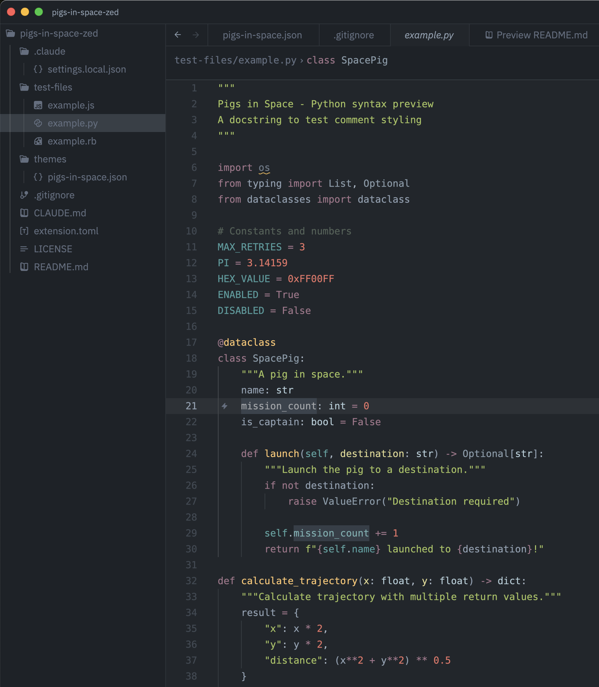

# Pigs in Space Zed Theme

A dark Zed theme that's easy on the eyes. Inspired by Solarized and Twilight, with soft, muted pastel colors so you can work all day without eye strain.

Port of the [VSCode Pigs in Space theme](https://github.com/kreek/pigs-in-space-vscode-theme).

## Installation

Search for "Pigs in Space" in the Zed extension gallery (`Cmd+Shift+X`).

## Manual Installation

1. Clone this repository
2. Open Zed and run `zed: install dev extension`
3. Select the cloned directory
4. Open theme picker (`Cmd+K Cmd+T`) and select "Pigs in Space"

## Color Palette

| Element | Color |
|---------|-------|
| Background | `#21262c` |
| Foreground | `#90A0B1` |
| Accent | `#4C9C9D` |
| Keywords | `#A2758A` |
| Functions | `#FFC66D` |
| Strings | `#A5C25C` |
| Numbers | `#e87366` |
| Comments | `#526057` |

## License

MIT
